# Introduction
Neural networks can be viewed as layers of building blocks **neurons** made up of weights, biases and activation function. A fundamental understanding of how these basic units function could make a world of difference as to you achieve your objective or not. In this study on activation functions an attempt is made to throw some light on how the choice of activations affects a model.

## Commonly used activation functions
**Sigmoid**: 
The sigmoid activation function squishes the real number line to values in *[0, 1]*. This non linear activation was historically used for a long time since it fell nicely with the biological neuron's firing rate. Nowadays these are rarely used and fallen well out of favor due to their limitation as shwon in the experiments below. Sigmoid functions suffer from saturating gradient problem and non zero centric response. The gradients at sigmoid activation could be very small when the units are saturated - this would effectively kill the neuron and prevent the network from learning. One can usually escape from the saturation behavior in shallow networks but with deep networks the progressively dying gradient are certain to affect the training. The other issue of non zero centric response could cause the weights to swing all positive or negative during backprop but this issue can be overcome with responses normalized before being passed to later layers.

> `Math form:  1/(1 + exp(-x))`

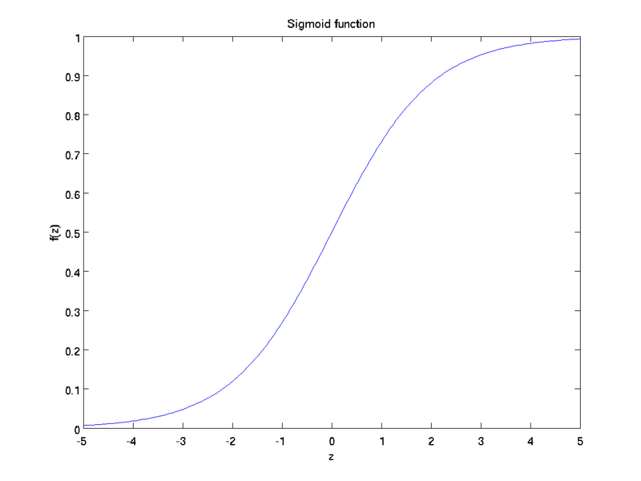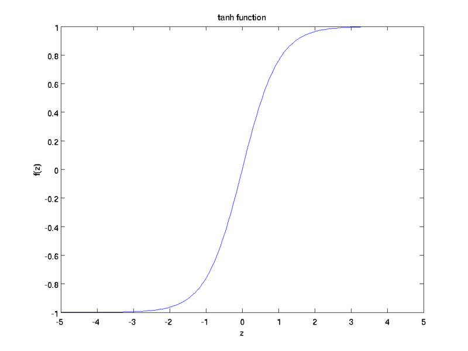

**Tanh**:
Tanh as shown in the image above squashes real values to the range *[-1, 1]*. These activation are still used in the final layer of image generative models but are rarely used on earlier layers. Tanh can be interpreted as scaled up version of sigmoid. Tanh, similar to sigmoid suffer from saturated gradients but as mentioned are nowadays used only in final layers so the gradients are rarely bound to have small values.

> `Math form: (exp(2x) - 1)/ (exp(2x) + 1)`

**ReLu**:
Rectified Linear Unit are considered to be one of the reasons for the resurgence of neural networks in the recent years. It is simply a clipping functions that zeros out all negative values. *(Left image below)*

> `Math form: max(0, x)`

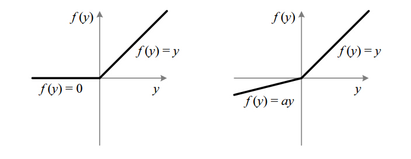

**Leaky ReLu**:
ReLu's are unstable and can die when large gradients flowing throw them cause the update to happen in such a way that they never get activated again. Leaky ReLus were introduced to overcome the "dying ReLu" problem and as the name suggests allows for small negative values. But these don't provide any improvement in performance with the recent advances in defining network architectures namely local response normalization and batch normalization as the gradients are scaled before being used for backprop updates. Nevertheless monitoring dead ReLU is still a good thing to do when training and replacing them with a leaky one if needed. The reason one might avoid a leaky ReLu during training is to reduce small valued floating point computations when backpropogation as compared to the standard ReLu. *(Right image above)*

> `Math form: max(ax, x) a in [0, 1)`

**ELu**:
Exponential Linear Units similar to leaky relus try to overcome the "dying ReLu" problem and are claimed to learn faster. But as shown from experiments below the difference in terms of convergence is very close to standard ReLu.

> `Math form: a(exp(x)- 1) for x < 0 and x for x > 0`

## Experimental Results
Legend: 

**MNIST**

The architecture used with MNIST data for this experiment was a 4 layered network (2 Conv layers, 1 fully connected, 1 softmax output layer) with pooling layers and dropout. The number of units, optimizer, learning rate were all fixed and only the activation function for the convolution and fully connected layer was varied for the experiment. All activations functions described above converged to relatively close values as seen from the graph below. 

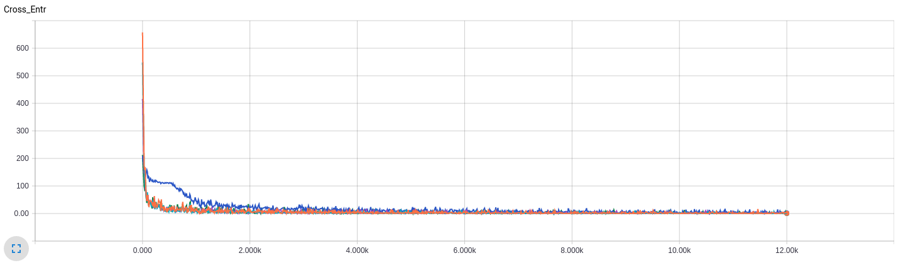

| **Activation Fn.** | **Test Accuracy** |
|------|--------|
| ELu | 0.9894 |
| LReLu | 0.9893 |
| ReLu | 0.9921 |
| Tanh | 0.9868 |
| Sigmoid | 0.9814 |

**CIFAR10**

Experiments using Cifar10 was able to expose certain issues discussed above. The model is made up of six layers (2 Conv layers, 2 fully connected, 1 softmax output layer) with pooling and local response normalization layers. Note that normalization layers unlike pooling layers affect the gradient flow during backpropogation - so effectively the model could be viewed as 8 layered.  Loss objective is made up of cross entropy and regularization loss on the weights in fully connected layers. 

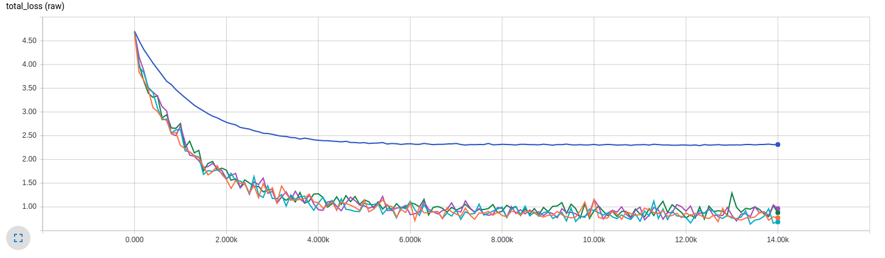
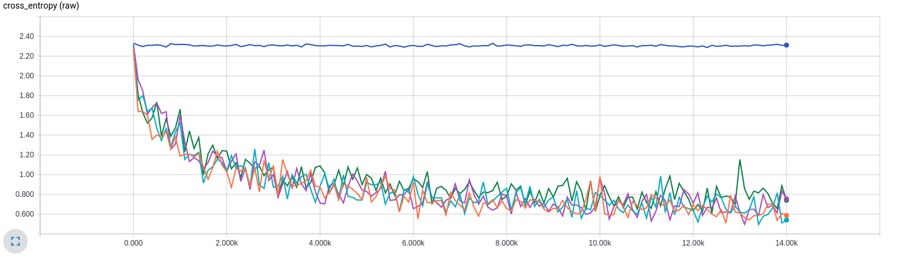

Notice how cross entropy in case of sigmoid activation doesn't improve at all. Total loss reduction is just the improvemnet in regularization. At this point one would throw in the towel and say sigmoid function is just not suitable in this model, but let's try to dig deeper.
I choose to look at the gradients in the first convolution layer as in backpropogation this would be the most affected if the model is ill posed.

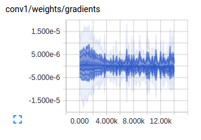
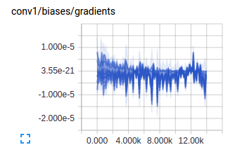

Well, the above plot pretty much says it all - we are facing the case of saturated activations for sigmoid which directly affects the gradient and updates in backpropagation. As described earlier in introduction as we increase the number of layers in the model sigmoid are more susceptible to weak gradient flow. (I have to claim responsibilty here as I purposefully for the sake of experiment tried to setup the model to expose these type of issues)
While we are at it, lets look at the gradients for other activation functions as well.

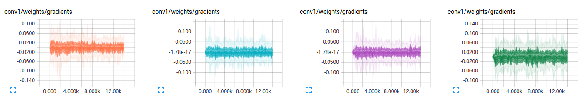
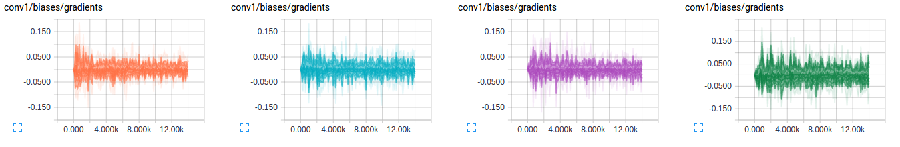

notice how similar gradients for the activation functions are - this would directly reflect on to how the model is minimizing its loss objective. One can very well look at the gradients and activations and say how well they are training. If there is one core take away message in this article I would say it is 
> # "Gradients talk"

Looking at just the loss objective rarely gives insights into the training process. I would strongly suggest to visualize gradients and activations as an important part of training neural networks.

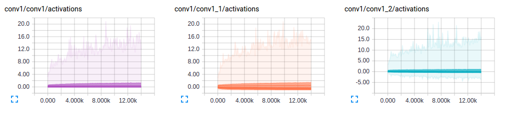
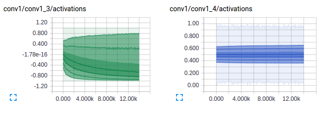

Notice also from the above activations, how very little of use the leakiness in relu affects this model. This aspect is debatable but even the small leakiness provides for a bit better generalizationin the model.
Overall I believe ELu > Leaky ReLU > ReLu but all these activations perform very closely and are only slightly better than the other.

Logs for the experiments can be found inside MNIST and Cifar10 folders respectively which can be viewed using Tensorboard.

*references: The images used in this markdown was borrowed from stanford cs231n notes, wikipedia, wolfram*
