## Difficulties training a Generative Adversarial Network 
So GANs are like the happening thing in Deep learning right now (I mean even Yann Lecun said so right!). But this writeup is not about how awesome GANs are (which they are :punch:), 
this is going to be more on how freaking difficult it is to train these models. I believe GANs might be slightly ill posed as a problem for training with gradient descent. 
Took me quite some time to figure out why the hell my model was not working at all - hoping to throw some light for those folks who might fall in the same pit while trying to implement GANs. 

For a basic introduction to generative models and GANs refer to my notes [here](https://github.com/shekkizh/neuralnetworks.thought-experiments/blob/master/Generative%20Models/README.md). 

1. [Introduction](#introduction)
2. [Observations](#observations)
3. [Results](#results)
4. [References and Useful links](#references-and-useful-links)

## Introduction
**Setup**

The basic setup of GAN is two networks **G(z)** and **D(z)** trying to race against each other and reach an optimum more specifically a Nash equilibrium. The definition of Nash equilibrium as per wikipedia is
> (in economics and game theory) a stable state of a system involving the interaction of different participants, in which no participant can gain by a unilateral change of strategy if the strategies of the others remain unchanged.

If you think about it this is exactly what we are trying with GAN, the generator and discriminator reach a state where they cannot improve further given the other is kept unchanged. 

Now the setup of gradient descent is to take a step in a direction that reduces the loss measure defined on the problem - we are by no means enforcing the networks to reach Nash eq. in GAN  which have non convex objective in a high dimensional space with continuous parameters. The networks try to take successive steps to minimize a non convex cost and end up in a oscillating process rather than decreasing the underlying true objective. There is an excellent paper by Goodfellow that tries to explain this problem [On Distinguishability criteria for estimating Generative models](https://arxiv.org/pdf/1412.6515.pdf).

Setting aside the above issue in a wishful manner, let's just train GAN by gradient descent - But just be mindful of the issue and the fact your GAN model may not converge.

**Importance of intialization and model setup**

As mentioned above the setup is already unstable and so it's absolutely crucial to setup the networks in the best way possible. I tried to follow the DCGAN model setup by Radford et. al in their [paper](https://arxiv.org/pdf/1511.06434v2.pdf) but suffered from bad intialization. In most cases you can right away figure out something is wrong with your model when your discriminator attains a loss that is almost zero. The biggest headache is figuring out what is wrong :weary:

Another practical thing that is done while training GAN is to stall one network or purposefully make it learn slower so that the other network can catch up. Most of the times it's the generator that lags behind so we usually let the discriminator wait - This is fine to some extent but remember that for your generator to get better you need a good discriminator and vice versa. Ideally you would want both the networks to learn at a rate where both get better over time. The ideal minimum loss for the discriminator is 0.5 - this is where the generated images are indistinguishable from the real images from the perspective of the discriminator.

**Feature matching**

This is an idea proposed in [Improved techniques for training GANs](https://arxiv.org/pdf/1606.03498v1.pdf) paper. The idea is to use the features at the intermediate layers in the discriminator to match for real and fake images and make this a supervisory signal to train the generator. I found training only based on this feature matching metric ineffective by itself contrary to what is mentioned in the paper - the discriminator attains almost zero loss right at the beginning when I tried doing this. Instead a combination of both the feature matching loss and the discriminator output loss for generator was quite effective. I tried setting up this combination loss such that initially the discriminator output loss for generator dominates, this avoided the discriminator loss to reach zero in the early stages of the training.

##Observations
The model used for the results below consists of 4 layer network for each generator and discriminator with batch norm. Leaky Relu's were used for discriminator with a sigmoid activation at the output layer while Relu's were used for generator with a tanh for the final layer. The filter depth was changed in multiples of 2. Images were resized to size of 64x64. Results below are for 15epochs of training on a succesful attempt. Latent space dimension was set to 100.

 

   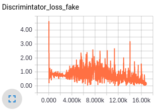

The generator loss is a combination of discriminator loss for generator and the feature matching loss hence the value of the loss seems high, but this I think is fine since with feature matching we are trying to match the statistics of dataset fed in batches and there is bound to be some loss.

Let's take a look at how the predictions of discriminator vary with training on real and generated images - Seems like the discriminator is confused and this is essential for training. Also the gradients for the first layer in both discriminator and generator are shown below to give an idea of how an good gradient flow are when the model is setup well.

   

   

Ahh the above would have been a beautiful result if I had got that in the first try :pensive: but the below is what I got.
A discriminator loss that just reaches values so small that there was no gradient flowing for the discriminator or values of scale of weights for the generator. The below plots show exactly what I mean. As always looking at the gradients just tells you that there is soemthing wrong with the scale of weights for the generator and the learning is just too slow.

   

Key takeaways to train a successful GAN:
 - Initialization - Can't stress this enough. I was not able to get any result with xavier initialization or with random normal intialization of deviation 0.2. Looking at the scale of gradients it just made sense to start with much smaller weights so that generator can start moving in the right direction from the beginning. Ended up using weights with random normal initialization with deviation of 0.02.
 - Batch normalization - These are supposed to help gradient flow but an improper decay or slow decay on the parameters used in batch norm is again going to hinder gradient flow. 0.9 seemed like the sweet spot.
 - Not sure how important this could be but I found that having equal number of layers in both generator and discriminator and having the number of weights at a ratio (approx 0.5) that doesn't make one model lag was helpful for training.
 - As for the dataset having inputs that similar traits to some extent seemed important - What I mean is trying to create varied outputs like cats and buses without doing a conditional generation is more complicated in terms of training.
 - For experimental purposes start with a small dataset and see if the gradients and initializations are in the right place for the model to train.

## Results
CelebA

Flowers

Sampling random points in latent space

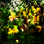

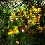
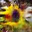

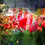

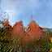

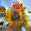

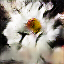
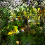
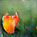
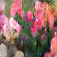

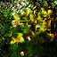
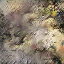

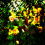
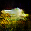
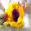

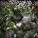

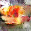

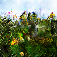
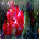
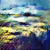
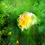

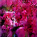

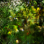
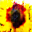

Now lets try taking a random walk along just one hidden space dimension.

Dimension 25

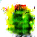
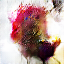
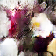
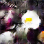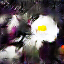
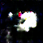

Dimension 50

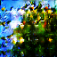
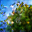
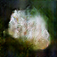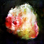
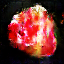

Dimension 75

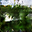
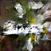
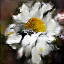
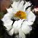
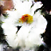

From what I was able to observe it seems like the samples from latent space when making random walks generate different image depending on whether we are on the negative or positive side of the dimension. This can be seen from the above results as well.

*Edit*: 
 A feedback I got on the post for the above statement was that while walking the latent space can get you from one image to another, there can be significant semantic relationships between those images (e.g. the same subject under a change of lighting, a rotation, etc.). Some dimensions can encode information about the geometry of the "scene", and others may encode information about how that "scene" is rendered. Of course, the features are anonymous, so some finessing and reverse-engineering is needed to figure that out. (credits to reddit u/Ameren)

I agree completely with the comment and do believe the relationships captured by the latent space do get complicated and less interpretive - I was just trying to point out the interpretation for the dimensions shown above.

----
Code for DCGAN in tensorflow can be found at [TensorflowProjects/Unsupervised_learning](https://github.com/shekkizh/TensorflowProjects/blob/master/Unsupervised_learning/)

As always let me know if you have comments or ideas. :v: :beers:

## References and Useful links
1. [Newmu/dcgan_code](https://github.com/Newmu/dcgan_code)
2. [carpedm20/DCGAN-tensorflow](https://github.com/carpedm20/DCGAN-tensorflow)
3. [Soumith's eyescream blog post](http://soumith.ch/eyescream/)
4. [OpenAI's Generative models](https://openai.com/blog/generative-models/)
5. [Image completion post by Brandon Amos](https://bamos.github.io/2016/08/09/deep-completion/)
