...Still under edit

##Difficulties training a Generative Adversarial Networks 
So GANs are like the happening thing in Deep learning right now (I mean even Yann Lecun said so right!). But this writeup is not about how awesome GANs are (which they are :punch:), 
this is going to be more on how freaking difficult it is to train these models. I believe GANs might be slightly ill posed as a problem for training with gradient descent. 
Took me quite some time to figure out why the hell my model was not working at all - hoping to throw some light for those folks who might fall in the same pit while trying to implement GANs. 

For a basic introduction to generative models and GANs refer to my notes [here](https://github.com/shekkizh/neuralnetworks.thought-experiments/blob/master/Generative%20Models/README.md). 

1. [Introduction](#introduction)
2. [Observations](#observations)
3. [Results](#results)
4. [References and Useful links)(#references-and-useful-links)

##Introduction

##Observations
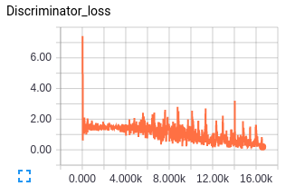   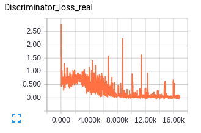   

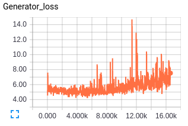

   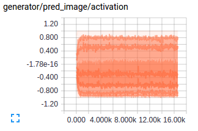

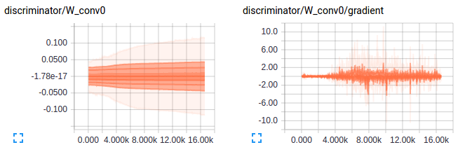   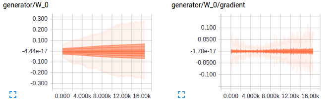

**Failed Training Observations** 

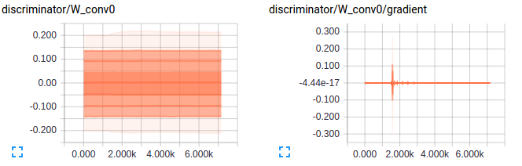   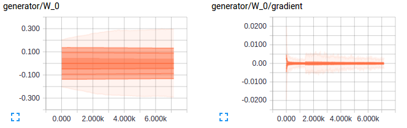

##Results
CelebA

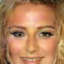

Flowers

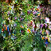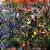
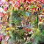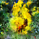
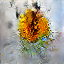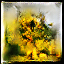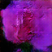
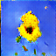
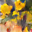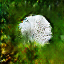
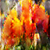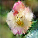
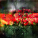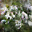

##References and Useful links
