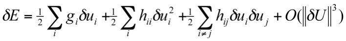
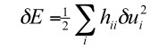
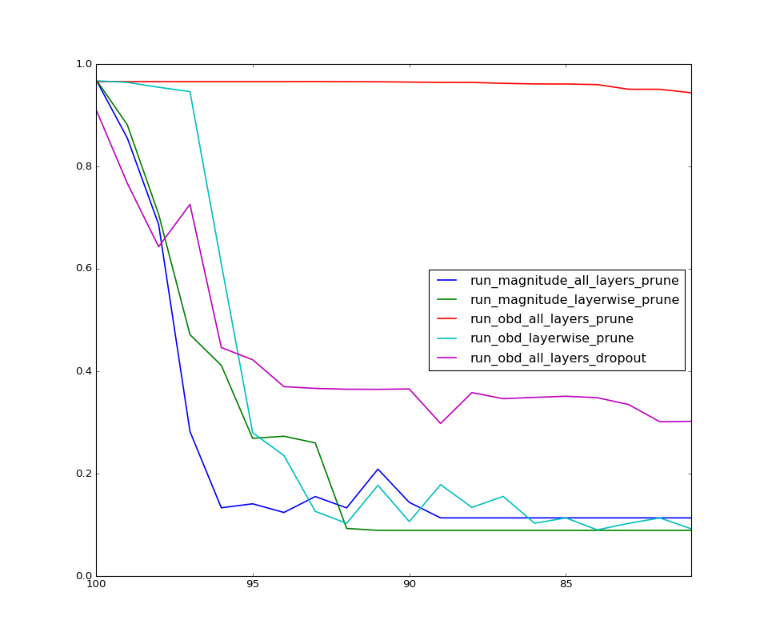
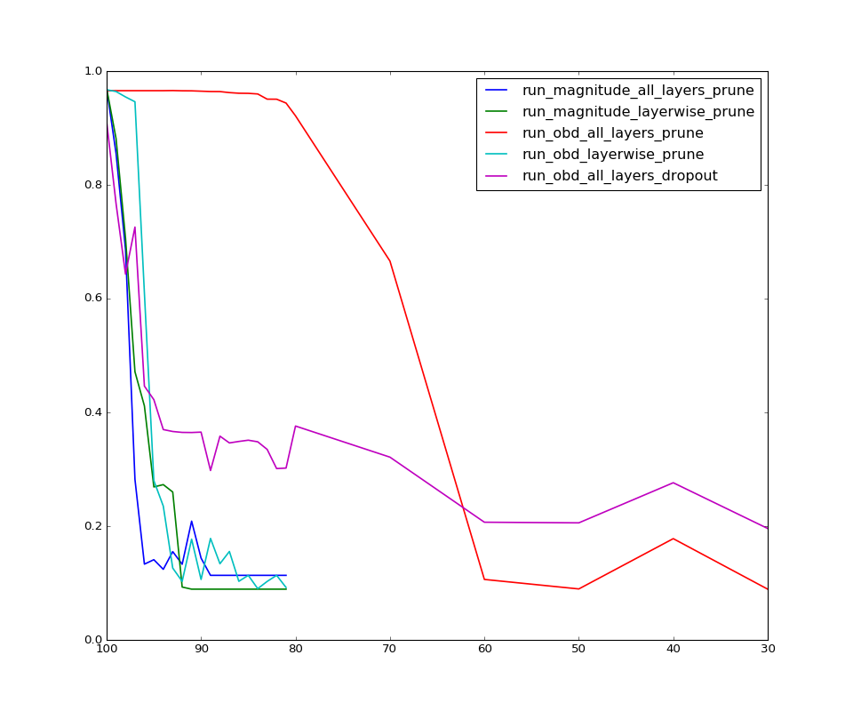

#Model Pruning

1. [Introduction](#introduction)
2. [Optimal Brain Damage](#optimal-brain-damage)
3. [Experimental Results](#experimental-results)

##Introduction
Model pruning in neural networks was the answer I ended up with when I got wondering about the workings of dropout, dropconnect and papers like [Do Deep Nets Really Need to be Deep?](https://papers.nips.cc/paper/5484-do-deep-nets-really-need-to-be-deep.pdf) and the follow up on [convolutional networks being deep](https://arxiv.org/pdf/1603.05691v2.pdf). 

The basic thoughts I had were along these lines, models are getting bigger and bigger but are we capturing information with each parameter and do we really need the **N** number of parameters we choose? Are we choosing more than what we need or are we choosing too less? The fact that dropout and dropconnect and such works just proves it should be possible to remove certains parameters without affecting the final objective. Also it seemed like I was just abusing my system by making it work with more and more parameters :grin:

These experiments are very prelimnary and are just for understanding how these methods work. The core idea in pruning is to find a **saliency** for the weight parameters and remove those with low saliency with the belief that these will affect the model least.

##Optimal Brain Damage
Seems model pruning in neural networks was studied and worked upon from very early times and LeCun's [Optimal brain damage](http://yann.lecun.com/exdb/publis/pdf/lecun-90b.pdf) is one of the classics on the topic. The second order derivatives, the Hessian on weights based on the loss objective are by definition be a very good saliency metric. But calculating these derivatives for models would require a lot of compute power and time and this would especially be true for models that are large, the likes of deep learning models we believe to work. The paper derives an approximation for saliency in terms of the second derivatives on weights with the consideration that the pruning process should be done within reasonable compute resources. 

Doing a Tayor expansion on the error function with respect to weights we get

Now if we can make the following assumptions the loss objective can be further simplified.
 - First assumption: The effect of changing weights on the loss objective in a model is the sum of the changes caused by individually changing the weights i.e deleting a weight doesn't affect how another weight affects the objective (third term can be neglected)
 - Second assumption: OBD is done after convergence. This would mean that the first term which is essentailly what we use for training to reach a minima by gradient descent can be neglected.
 - Third assumption: Third and higher derivative terms can be neglected assuming quadratic loss objective. (last term)

This leaves us with saliency of weights as 

The above term is fairly easy to calculate with backprop and doesn't cost lot of compute resources.

##Experimental Results
All experiments were done on MNIST dataset with a fairly simple 4-layer fully connected model using Tensorflow. The total  number weights in the model is about 50K. Pruning was done in percentiles and the performance of the model on test dataset was recorded (1 percentile = 500 weights approx).

Experiments were done with **Magnitude** and the second derivative as derived in **OBD** as saliency separately. Also observations were made with layer wise pruning meaning remove weights by saliency for each layer separately and all layer pruning, remove weights based saliency over all weights in the model. One additional experiment was done on the same model with dropout (keep probability = 0.8) with all layer pruning based on second derivative saliency - the thought being if the model could be trained to work with dropout then we should be able to prune more easily.

The plot below is between Percentage of eeights pruned Vs Test accuracy. Pruning in all cases was done after training the model on train dataset.

Interesting results! All layer OBD based saliency for the win ehh?! Now let's look at how the all layer obd models perform with even more pruning

Observations:
 - As expected the magnitude based pruning just flat out decreases in performance with more and more pruning. Note that there was no retraining after pruning. I do understand that the performance should be bad but why it performs so badly is slightly confusing. One resoning I have is to think that these low magnitude weights try to scale down the value passing through and which is essential for the layers above to work well.
 - Working with saliency over all the weights does better than layer wise pruning. This can be explained by the fact that each layer works with different magnitude of weights and removing weights layer wise though would affect the specific layer results less it adversely affects the subsequent layers. Note even that even second derivative saliency performs bad - least peturbation in layer doesn't mean least perturbation overall.
 - One thing that suprised me was the results with the model using dropout but thinking later was a bit obvious. Remember the cross term assumption we made during deriving saliency in OBD - well that has come to bite us back. Dropout strongly encourages cross term dependency instead of relying very naively on weights, in fact this is very much the reason they work so well. 
 
 Also while at it I would like to clear something most people think about dropout - that this produces an ensemble of models, well yes but not the sought of way you do with random forests. Remember that you share the same weights and you are still training a single model with dropout - I believe dropout makes the neurons in the model to not rely solely on a particular sequence of ops on input and enourages the model to be more aware of different parts of the same model.

- Another intersting thing was how the dropout model perfoms better than that without dropout when the model is heavily pruned. I think this is where the saliency based on just the diagonal becomes more important than the cross terms in Hessian which by assumption we neglected - this is also visible with how the accuracy varies very similar in both the models after this crossing point. Finally the pruning with dropout pays off with slightly better performance, remember the expectation initially was dropout and pruning will work good together. So it's just that the assumption we made while deriving saliency in OBD doesn't hold with dropout models initially.

I hope to work on more experiments in pruning with retraining and pruning in convolutional networks and the above results is just touching the basics. Let me know if you have ideas :v: 

---
Logs for the result can be found in [logs folder](./logs)

Code for the experiments can be found in [folder here](https://github.com/shekkizh/TensorflowProjects/tree/master/Model_Pruning)
