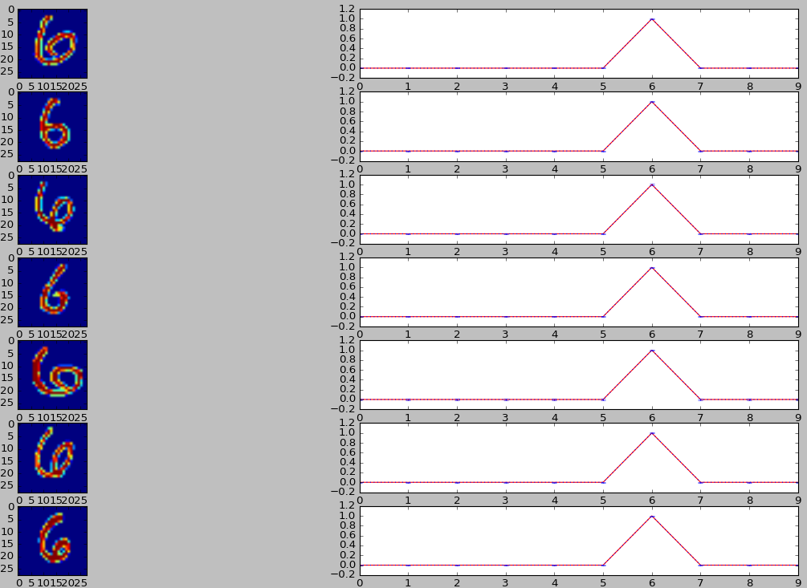
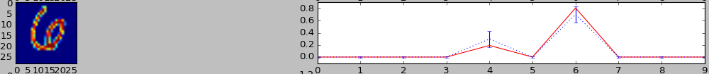
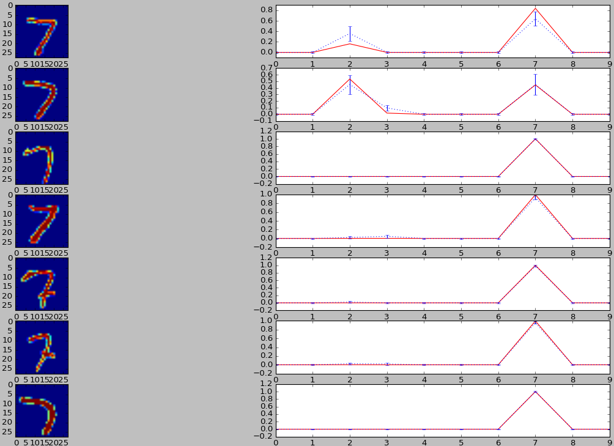

#Uncertainty in Models
This experiment is based on the results published by Yarin et. al. on the interpretation of dropout as uncertainty in models. The central idea behind the paper is in interpreting uncertainty in models via dropout i.e By introducing dropout at test time we can draw mean and variance information over an input which helps us to concretely explain how are deep learning models interprets the input. Alternatively when we train a network with dropout, by the above explanation we are forcing the network  to learn under some uncertainty and hence the model is made to avoid over fitting.

Paper links: Dropout as a Bayesian Approximation[appendix](https://arxiv.org/abs/1506.02157) [paper](https://arxiv.org/abs/1506.02142)

1. [Results](#results)
2. [References](#references)

##Results
The results below are obtained on MNIST with dropout in fully connected layer. The red line corresponds to inference with no dropout at test time. The blue dotted lines correspond to the mean and variance for inference over 100 iterations. 

The model architecture for the below results is 2 conv layers - fc layer with dropout - softmax layer. Training was done with dropout probability 0.1 - This means that at test time if we have the same dropout probability, the model should be fairly confident of it's inference. This cab be seen in the below result.

Now if we introduce higher dropout, the model should show signs of uncertainty as it is not trained to overcome this. Higher the dropout higher the uncertainty. Some examples of uncertain predictions that the model makes are as below.

In the result below, we see the type of inputs where our model is uncertain and those were it is confident. This gives us valuable information on our model. Such insights gives us an idea of whether we need to train our model further, include more data and such.

##References
 - Yarin Gal's blog post - [link](http://mlg.eng.cam.ac.uk/yarin/blog_3d801aa532c1ce.html) 
 - Presentation at MSR - [Video](https://www.youtube.com/watch?v=3ONLxYeM1Sc&index=14&list=WL&t=1030s)
 - Tensorflow code for the experiment - [link](https://github.com/shekkizh/TensorflowProjects/master/MNIST/Uncertainty_modelling.py)
